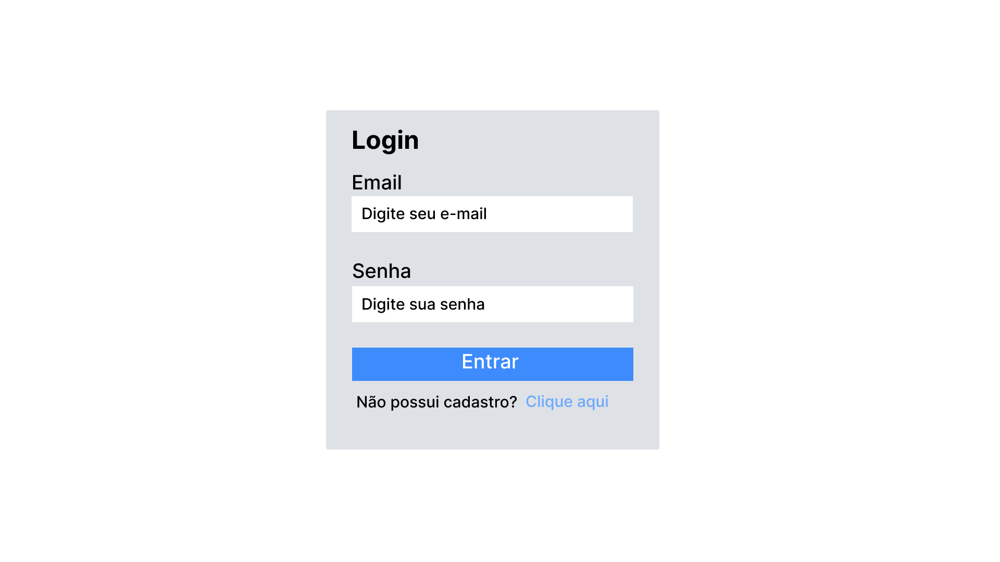
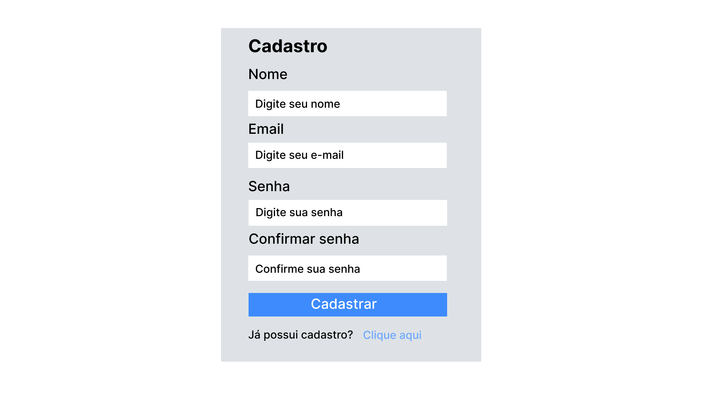
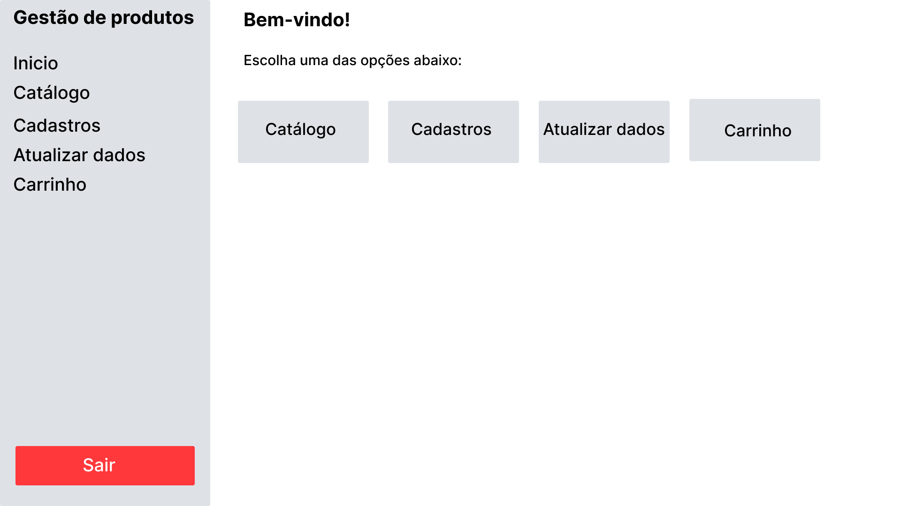
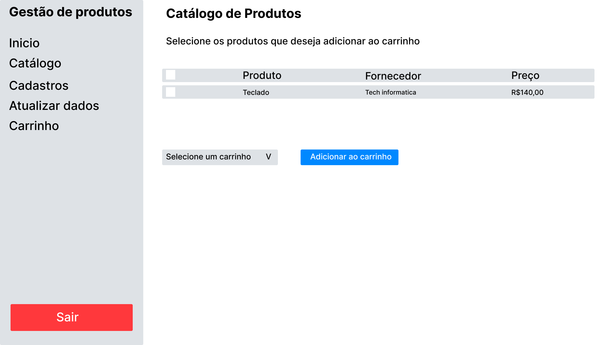
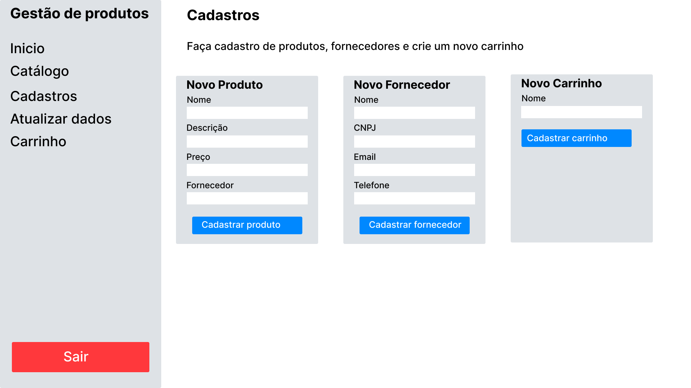
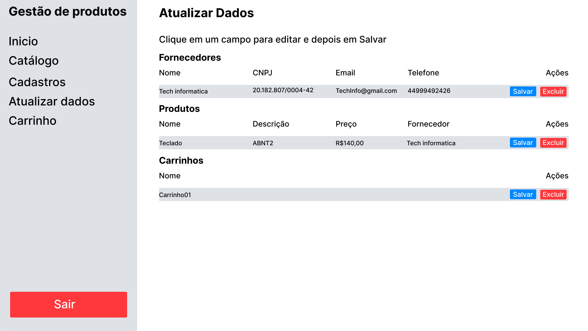
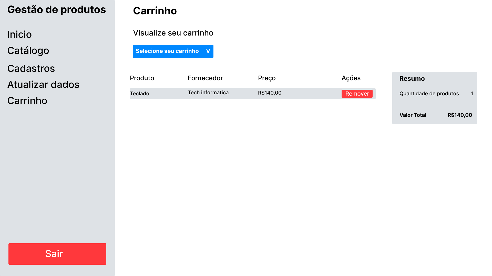

# Sistema de Gestão de Produtos

Sistema web para cadastro de produtos, fornecedores e carrinhos de compras, com autenticação de usuários. 
## Integrantes

| Nome | RA |
|---|---|
| Luiz Fernando Tresoldi Miguel | 60008139 |

## Tecnologias

- PHP 8 com PDO
- MySQL
- HTML, CSS, JavaScript e AJAX
- Bootstrap 

## Funcionalidades

- Cadastro e login de usuários, com senha armazenada em hash SHA-256
- Proteção das telas internas por sessão e logout
- Cadastro de fornecedores, produtos e carrinhos
- Atualização e exclusão dos registros via AJAX, sem recarregar a página
- Catálogo com seleção de produtos por checkbox e validação antes de enviar ao carrinho
- Carrinho com lista de produtos, remoção de itens, quantidade e valor total
- Mensagens de sucesso e erro em todas as operações
- Criação automática do banco de dados e das tabelas no primeiro acesso

> A **Cesta** descrita no enunciado foi chamada de **Carrinho** no sistema. Cada usuário pode criar vários carrinhos, e cada produto entra apenas uma vez em cada carrinho.

## Como executar

1. Instale o [XAMPP](https://www.apachefriends.org/) e inicie o **Apache** e o **MySQL**
2. Clone o repositório dentro da pasta `htdocs`

```
   git clone https://github.com/LuizTresoldi/sistema_de_gestao_do_luiz.git
```

3. Se o seu MySQL tiver usuário ou senha diferentes do padrão (`root` sem senha), ajuste em `BackEnd/Conexao.php`
4. Acesse `http://localhost/sistema_de_gestao_do_luiz/FrontEnd/loginSistema.php`
5. Crie uma conta em "Clique aqui" e faça login

O banco `sistema_de_gestao_do_luiz` e todas as tabelas são criados automaticamente no primeiro acesso.

## Estrutura de pastas

```
BackEnd/    classes (Conexao, Usuario, Fornecedor, Produto, Carrinho) e arquivos de processamento
FrontEnd/   telas do sistema, barra lateral e mensagens
imagens/    DER e esboços das telas
```

## Esboços das telas (Figma)

Projeto completo no Figma: [Gestão de Produtos](https://www.figma.com/design/fWX00hFnVtJYBGCnKJo793/Gest%25C3%25A3o-de-Produtos?node-id=5488-1255&p=f&t=4GR4DnV39357NWNU-0)

### Login


### Cadastro de usuário


### Início


### Catálogo


### Cadastros


### Atualizar Dados


### Carrinho


## Diagrama Entidade Relacionamento


